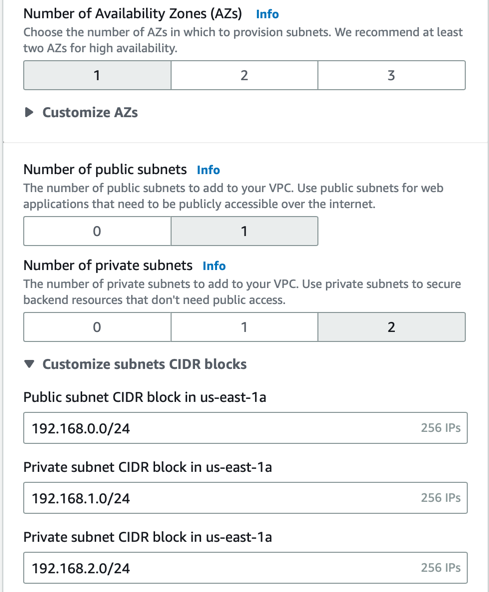
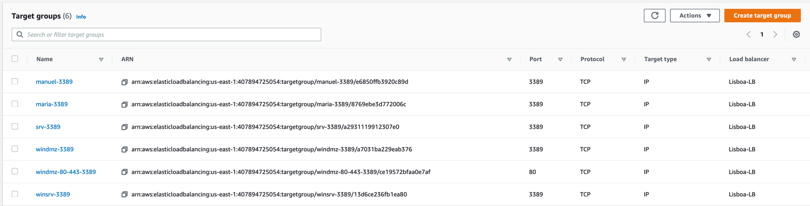
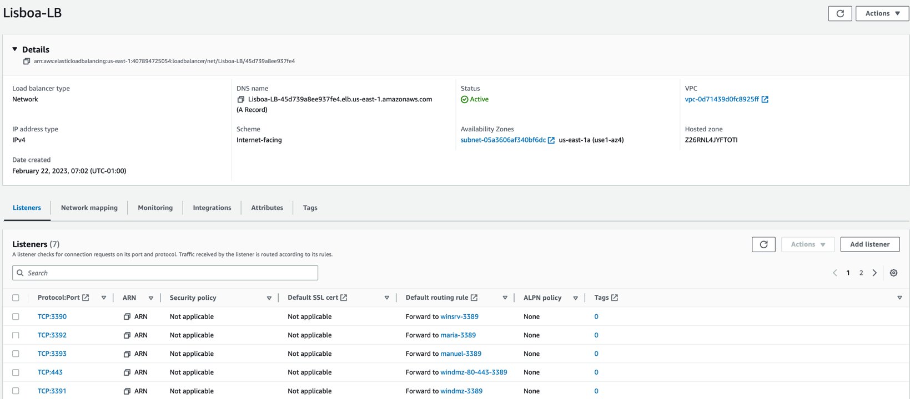
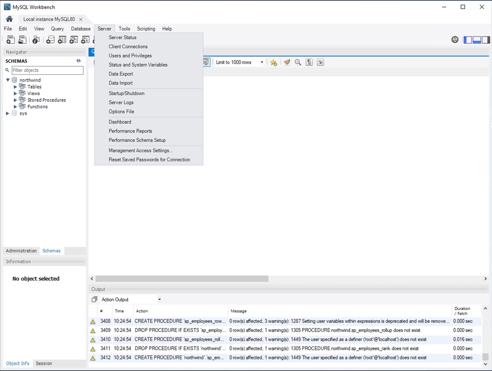
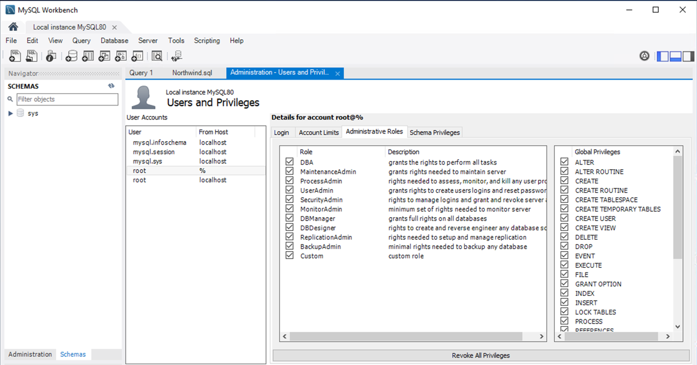
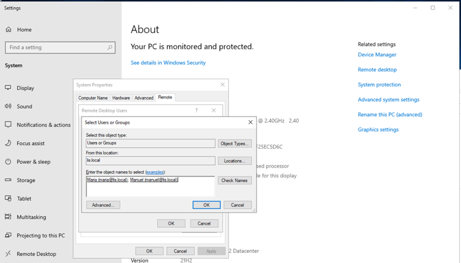
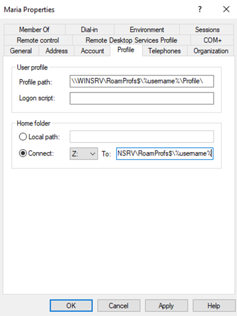

Create VPCs com respetivas subnets tendo o cuidado de abrir os detalhes para forçar as máscaras das subredes para /24

Por exemplo, no VPC Lisboa fica assim:



Criar IP based target groups; um para cada IP. No caso do DMZ são 3 portas: 80, 443, 3389



Criar network load balancer e adicionar listners:




Mudar o nome de todas as máquinas para o nome que está na topologia

Para mudar a password do Administrator para Passw0rd em todas as máquinas:

ATENÇÃO: Há IPs que não de pode usar. Usem sempre >=.10 e <=.200


```
$pass = Read-Host -Prompt "Set Password" -AsSecureString
# Não te esqueças de fazer o segundo comando depois de teres inserido a password em resposta ao primeiro !!!
Set-LocalUser administrator -Password $pass
```

Após inserir o primeiro comando ele pede a password que será Passw0rd.

**winslq.portimao.pt**

Instalar o MySQL server e o Workbench

Abrir o Workbench e adicionar o utilizador root mas em vez de 'localhost' usar '%'





Importar o Northwind.sql e executar; or warnings são normais.

Nos clientes, entrar como LIS\Administrator e adicionar a maria e o manuel aos remote users:




Roaming profiles

https://www.youtube.com/watch?v=fb8s1YA63CE




NÃO ESQUECER DE CLICKAR EM STOP SOURCE/DEST CHECK NO winsrv.lis.local

Certificates
https://thesecmaster.com/step-by-step-procedure-to-set-up-a-standalone-root-ca-on-windows-server/

...e uma máquina Ubuntu para a salvação:

```
apt update
apt -y upgrade
apt -y install easy-rsa
cd /etc/
cp -R /usr/share/easy-rsa/ easy-rsa
cd easy-rsa/
./easyrsa init-pki 
./easyrsa build-ca nopass (colocar o common name do Windows... tipo EC2AMAZ-KQMRHS6-CA)
/easyrsa gen-req www.Lisboa.pt nopass
./easyrsa --subject-alt-name="DNS:www.Lisboa.pt" sign-req server www.Lisboa.pt
./easyrsa export-p12 www.Lisboa.pt
mv /etc/easy-rsa/pki/private/www.Lisboa.pt.p12 /etc/easy-rsa/pki/private/www.Lisboa.pt.pfx
apt install apache2
cp /etc/easy-rsa/pki/private/www.Lisboa.pt.pfx /var/www/html/
cp /etc/easy-rsa/pki/ca.crt /var/www/html/
chmod ugo+r /var/www/html/*
```
